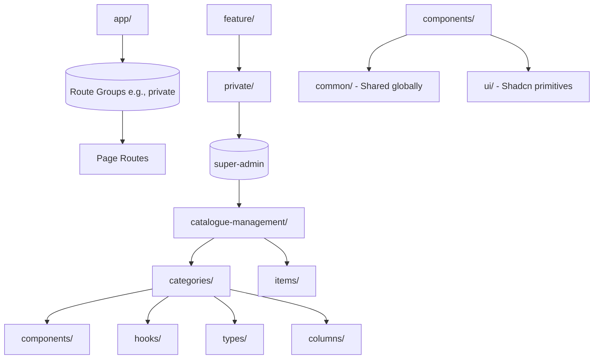

# Architecture & Folder Structure

To keep the Food Remit codebase predictable, scalable, and maintainable, we use a hybrid approach combining the **Next.js App Router** paradigm with a **Feature-Sliced Design (FSD)-inspired architecture**.

As applications grow, organizing code purely by technical type—for example, keeping all hooks in one folder, all components in another, and all types in a separate folder—can become difficult to maintain.

Instead, we organize the code primarily around **business domains and features**.

## High-Level Diagram



## Directory Breakdown

### `app/`

The `app/` directory is responsible strictly for:

- Routing
- Layouts
- Route groups
- Page definitions
- Loading and error boundaries where required

Business logic should be kept to a minimum here.

Pages should primarily be responsible for composing and rendering the appropriate feature or container components from the `feature/` directory.

---

### `feature/`

The `feature/` directory contains the core **business logic and domain-specific functionality** of the application.

Features should remain isolated and self-contained.

For example:

```text
feature/
└── private/
    └── super-admin/
        └── catalogue-management/
            ├── categories/
            │   ├── components/
            │   ├── hooks/
            │   ├── types/
            │   └── columns/
            │
            └── items/
                ├── components/
                ├── hooks/
                ├── types/
                └── columns/
```

The `categories` feature should contain everything specifically related to category management, including:

- Feature-specific components
- Feature-specific hooks
- TypeScript types
- Table columns
- Feature-specific business logic

A feature should **not deeply import internal implementation details from another sibling feature**.

If another feature needs something, it should be explicitly exposed through a well-defined public interface.

---

### `components/`

The `components/` directory contains reusable UI components that are not tied to a specific business feature.

It is divided into two main categories:

#### `ui/`

Contains low-level, reusable UI primitives, primarily generated or built using **Shadcn UI**.

Examples:

- Button
- Dialog
- Input
- Select
- Dropdown
- Tooltip

These components should remain generic and business-logic-free.

#### `common/`

Contains reusable UI blocks that are slightly more complex and are shared across multiple features.

Examples:

- `DataTable`
- `PageHeader`
- `StatusTabs`
- Shared filters
- Common table controls

These components should remain generic enough to be reused across different business domains.

---

### `lib/`

The `lib/` directory contains reusable utilities and infrastructure that do not depend on React component lifecycle or feature-specific business logic.

Examples include:

- `cn()`
- `debounce()`
- Date utilities
- Formatting helpers
- API client configuration
- Generic utility functions

The goal is to keep `lib/` framework-independent wherever practical.

---

### `config/`

The `config/` directory contains static application-level configuration.

Examples include:

- Route definitions
- Permission mappings
- Navigation configuration
- Application constants
- Feature configuration

For example:

```ts
ROUTES.ADMIN.CATEGORIES;
ROUTES.ADMIN.ITEMS;
```

Configuration should be centralized rather than duplicated throughout feature code.

---

# Core Philosophy: Colocation

The primary architectural principle is **Colocation**:

> Keep code as close as possible to the feature or component where it is used.

For example, if a hook is only used for Item CSV uploads, it should remain inside the Item feature:

```text
feature/
└── .../
    └── items/
        └── hooks/
            └── use-upload-item-csv.ts
```

Similarly, if a component is only used by the Category Grid, it should remain inside:

```text
feature/
└── .../
    └── categories/
        └── components/
```

This makes features easier to understand, modify, test, and eventually remove.

## When to Promote Shared Code

Do not move code into global folders prematurely.

If a component, hook, or utility is initially used by only one feature, keep it colocated with that feature.

When the same functionality becomes genuinely reusable across **three or more unrelated features**, it can be promoted to an appropriate shared location such as:

```text
components/common/
```

or:

```text
hooks/
```

### General Rule

**Start local → Identify reuse → Promote when necessary.**

This prevents the shared folders from becoming a dumping ground and keeps the codebase organized around actual business domains rather than hypothetical future reuse.
